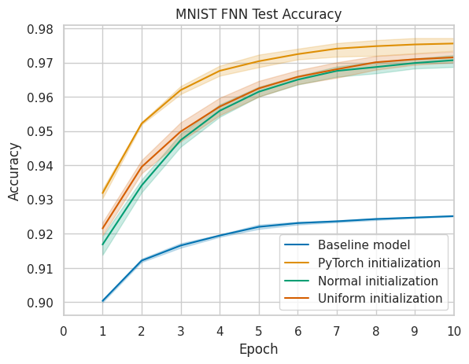
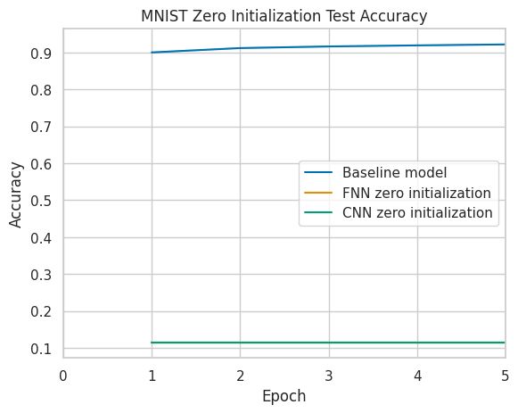
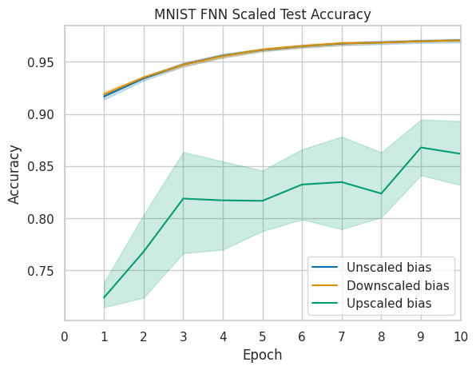

# Training neural network with zero weight initialization

In this repository we investigate issue of symmetry in neural networks related to zero weight initialization, and we
propose an initialization approach which uses zero weight initialization combined with randomly initialized biases in
order to break symmetry.

The reported experiments have explored the ability to train NNs initialized by zero initialization for different
datasets and architectures.

The performed experiments show that the symmetry introduced by zero initialization can be overcome by a bias
initialization. Thus, this shows that our approach clearly outperforms zero initialization in our experiments.

    
    

Despite the fact that we were able to break the symmetry in zero initialized NNs, we still want to highlight that there
is a gab in performance between our approach and the LeCun initialization, which we used for comparison. We did not
investigate in the cause of this gap or in how to close it, instead we keep it for future investigations.

Furthermore, our experiments show that large initial biases caused instability during training, whereas small biases did
not. This might be caused by an over amplification of the input signals during the forward pass. Thus, those signals
might be heavily penalized in the backward pass. Further investigation in the cause of this behavior is kept for future
research.

    

Furthermore, we noticed a change in the learning dynamics of models initialized with our approach compared to the LeCun
initialization. The weights of the layers of the networks initialized with our approach are clearly updated from the
output layer to the input layer in the initial phase. Thus, during this phase after each iteration step one layer more
is updated, this can be seen in the Figure below. We explain this behavior with the cut-off gradient flow in the
backpropagation while the weights are still zero. Thus, a layer can only be updated when the layer after it has been
updated already.

    

More details can be found in the paper in this repository.