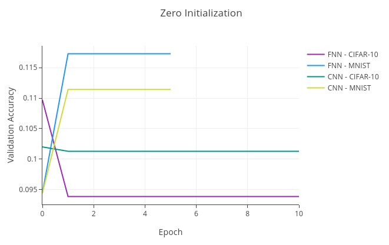
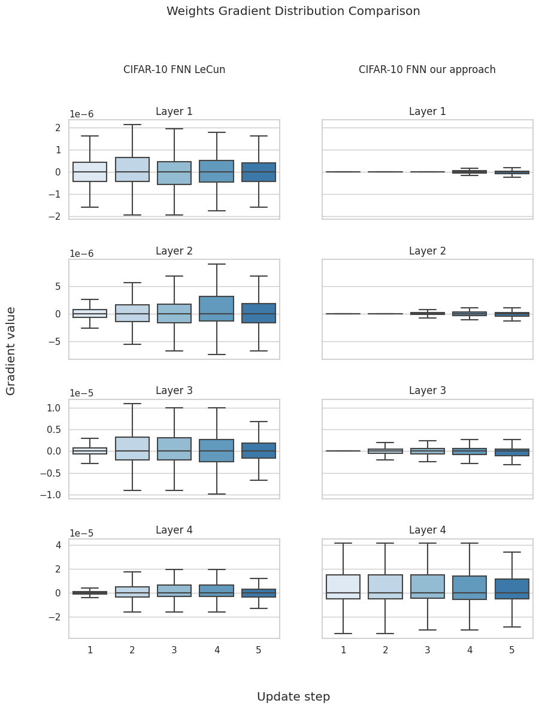

# ZeroInitialization

Initializing the parameters of a neural network can be critical to the model’s ultimate performance. Initializing neural
network parameters with 0 leads to symmetrically evolving neurons throughout training. Thus, such neurons will learn the
same features during training. This limits the capability of a neural network dramatically. However, in this repository
I show that one can still initialize the weights of a neural network with 0 and overcome the symmetry by initializing
the bias of the network randomly. For this I trained different neural network architectures on the MNIST and CIFAR-10
datasets, to show that they get close to the models initialized by the PyTorch initialization methods. Furthermore, this
training procedure reverts the training in the initial phase, thus, high-level layers are updated first.

In order to show that this approach not only holds in an experimental setup the following plots show the results of a
ResNet-50 model which shows that the results of the experiments also hold for more sophisticated models.

The rolled-out experiments show that a randomly initialized bias can break the symmetry in neural networks introduced by
initializing the weights with 0. Since neurons in layers of networks in which this mentioned symmetry occurs cannot
learn different features, their performance will not be significantly better than a random predictor which just predicts
the most common class in the dataset as the following plot shows.

It is also notable that there is a change in the learning dynamics when initializing neural networks with the presented
approach. Since the gradient flow during back propagation is cut off while the weights of the layer are still 0, this
reverses the learning. Thus, the networks updates the layer from the highest level to the lowest label. This can be
shown by checking the gradients during the first few update steps, which is shown in the following plot. In the plot
below you can see the gradient distribution of the weights from the input layer to the output layer.

On the left one can see the gradients of a model initialized with the PyTorch initialization and on the right the
gradients of a model initialized with the presented method. This plot clearly shows how the layers gradually get updated
output to input layer.

A more detailed report of the experiments and the implications will follow soon. 
